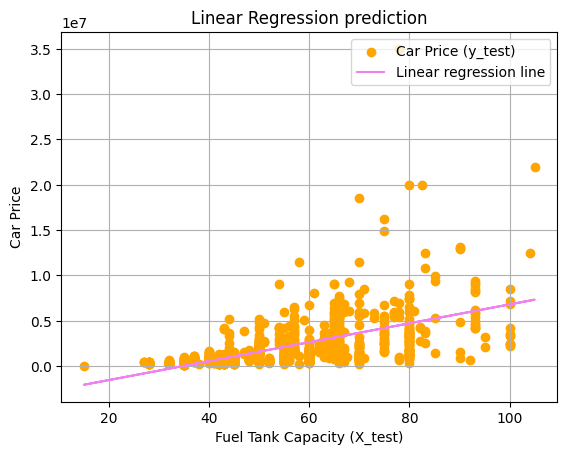

# Linear Regression Example

In this Linear Regression Example, we consider whether it is possible to predict the car price, from its Fuel Tank Capacity.

To do this exercise, I have used a vehicle dataset from Kaggle. (Here is the address of this dataset: https://www.kaggle.com/datasets/nehalbirla/vehicle-dataset-from-cardekho)

These datasets have different categories. In this exercice, I have chosen to explore whether it is possible to find the car selling price from the capacity of its fuel capacity.

Linear regression can be very useful when there is an almost linear dependency between the variables. 

The provided code is in Python.

The Linear Regression prediction is shown in the following figure:

